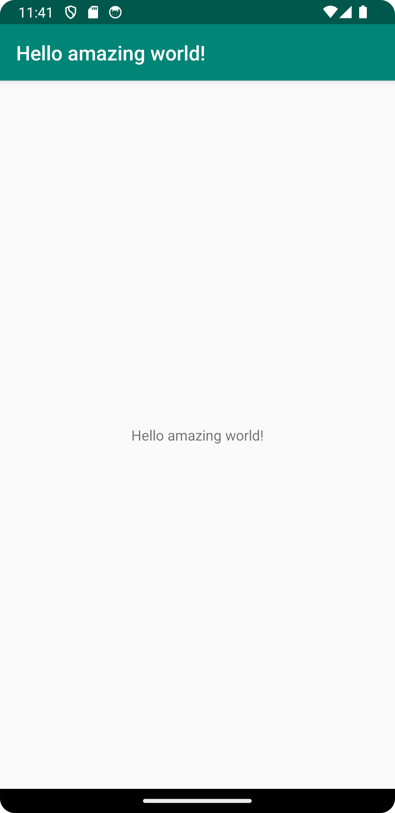

# Rapport
```
<resources>
    <string name="app_name">Hello world!</string>
</resources>
```
I filen strings.xml finns en variabel <string name="app_name">Hello</string> och där ändras genom att ändra en värde från "Hello" till "Hello amazing World" som visas i ovanför koden. 



Koden gör att visa en text "Hello amazing World!" på webview som visas ovanför bilden.

## Fördelar
- Denna prototyp kan förbättras med användarnas hjälp för att testa vår applikation och ge feedback. Om någon hittar en bugg eller ge ett eller flera förslag om en ny funktion som kan jag implementera det.
- Jag är bara en person som utveckla applikationen, vilket gör att det går långsamt, men applikationen förbättras när tiden går om att jag lägger till mer funktionalitet.
- Prototypen är gratis och kan laddas ner direkt från min kod, men det skulle vara bra om ni kunde supporta till mig så att applikationen kan bli ännu bättre och släpper nya versioner snabbare.

## Nackdelar
- Applikationen fortsätter som prototyp, vilket innebär att krascher, programfrysningar eller hackningar kan uppstå.
- Prototypen har begränsad funktionalitet, vilket innebär att applikationen inte har så många funktioner, till exempel att växla mellan ”DarkMode” och ”Light Mode”.
- Prototypen är inte skyddad mot hackare, men jag fortsätter att hitta och snabbt åtgärda säkerhetsproblem när de uppstår.

Läs gärna:

- Boulos, M.N.K., Warren, J., Gong, J. & Yue, P. (2010) Web GIS in practice VIII: HTML5 and the canvas element for interactive online mapping. International journal of health geographics 9, 14. Shin, Y. &
- Wunsche, B.C. (2013) A smartphone-based golf simulation exercise game for supporting arthritis patients. 2013 28th International Conference of Image and Vision Computing New Zealand (IVCNZ), IEEE, pp. 459–464.
- Wohlin, C., Runeson, P., Höst, M., Ohlsson, M.C., Regnell, B., Wesslén, A. (2012) Experimentation in Software Engineering, Berlin, Heidelberg: Springer Berlin Heidelberg.


